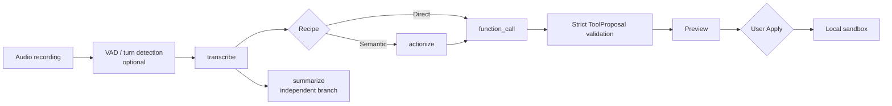
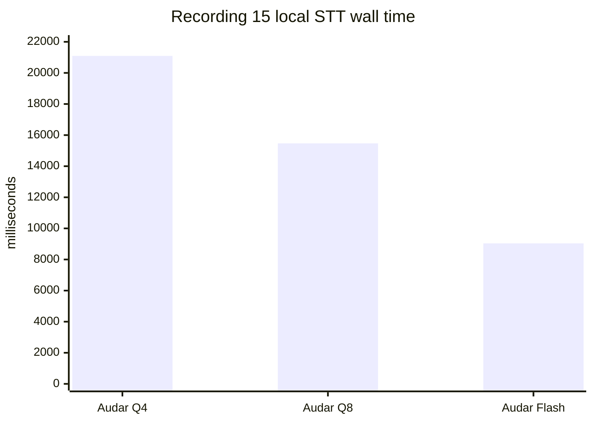
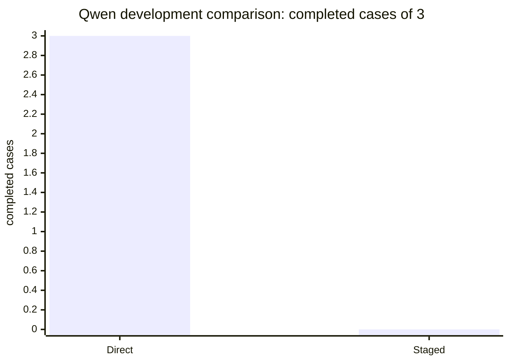

# Saudi STA

Saudi STA is a local workbench for testing Saudi Arabic and Arabic/English
speech-to-action pipelines. It records audio, runs a selected local speech
model, sends the resulting transcript through independently selected semantic
and tool stages, and applies only validated proposals to a local sandbox.

The first complete local path is working:

```text
Recording (15).m4a
  → Audar Turbo Q4
  → Qwen3.8-27B Q6_K_L
  → JSON emulation + strict ToolProposal validation
  → add_list_items
  → local sandbox
```

For the phrase `<REDACTED_PRIVATE_TRANSCRIPT>`, the
route produced:

```json
{
  "status": "READY",
  "tool_name": "add_list_items",
  "arguments": {
    "list_name": "المقاضي",
    "items": ["البيض", "الحليب"]
  }
}
```

Applying that proposal once changed the sandbox. Applying the same proposal
again returned `ALREADY_APPLIED`. Editing the transcript made the old proposal
stale and the server rejected it. No message, reminder, calendar, network, or
other external action is available to the sandbox tools.

Maintainer and sole Git contributor: **iO7i**.

## Run it locally

This repository is designed for a machine-local, zero-spend run. It does not
create an account, call a hosted inference provider, or download a model during
startup.

```powershell
.\.venv\Scripts\python.exe -m uvicorn app.main:app --host 127.0.0.1 --port 8080
```

Open <http://127.0.0.1:8080>. The loopback bind is intentional. Use the
Workbench to upload or record audio, choose the stage bindings, run a route,
inspect the transcript and proposal, and apply a valid proposal to the local
sandbox.

Run the tests with:

```powershell
.\.venv\Scripts\python.exe -m pytest -q
```

The current closeout passes **64 tests**. `node --check static/app.js` and
`git diff --check` also pass.

## How a route is assembled

The application stores a recipe as a stage graph. Each stage has its own model
binding; the application never turns a recipe into one global “AI model”. A
route may bypass stages that it does not need.



The available stage names are `vad`, `turn_detection`, `diarization`,
`transcribe`, `summarize`, `actionize`, `function_call`, `verify`, and
`synthesize`. Reserved stages can remain unavailable without producing a fake
success.

The three route shapes used by Slice 02 are:

```text
Direct                 audio → transcribe → function_call
Semantic               audio → transcribe → actionize → function_call
Semantic + summary     audio → transcribe → summarize
                                  └──────→ actionize → function_call
```

The summary branch receives the original transcript. It is not used as a lossy
input to function calling.

## Local models currently available

Model weights live outside Git and are discovered from verified manifests.
Their arrival never activates a route automatically.

| Candidate | Role | Current local state |
| --- | --- | --- |
| `AUDAR_TURBO_Q4_LOCAL_BRIDGE` | `transcribe` | Runtime-certified; decoder SHA-256 `c55e3c28225ef6e9b56906a6463af62d34ed417803c45f3b7b20f463af2e8cf4`; BF16 projector SHA-256 `190459e806938175711779847eb62ea609cd78b8d2ec06fb96a94d69ab37a9be` |
| `AUDAR_TURBO_Q8_LOCAL` | `transcribe` | Runtime-certified; decoder SHA-256 `0a91ab40f6a30db06c4186e2f621f504f4625ba6058e639cc09f1cbefded10d2` |
| `AUDAR_FLASH_Q8_LOCAL` | `transcribe` | Runtime-certified; decoder SHA-256 `1b01c707fcf162ef8e844a89f0833bd0d005933342e0c37fa8da164497a9fb38`; projector SHA-256 `73f06fc82a009b4a9d6c825782a3676cb553402b3a5ecc27ae77a92caa6b7fa9` |
| `QWEN38_27B_Q6_K_L` | `function_call`; direct action extraction | Runtime-certified for local chat and JSON emulation; artifact `D:\Qwen3.8-27B-UD-Q6_K_L.gguf`, 24,193,919,904 bytes, SHA-256 `121355b4c7422771da25adc74090e3c90138f77ce5c92d348687d47824ec80f4` |
| Whisper Large v3 | `transcribe` | Prior local evidence exists, but the current Transformers binding is unavailable until the existing Torch/Transformers runtime is installed; no automatic install is performed |

Qwen uses llama.cpp `b10909-a2878d30d`, CPU execution, reasoning disabled,
temperature `0`, a 160-token bound, and `JSON_EMULATION`. Native JSON grammar
and native tool calls are not certified. The emulation path still passes the
same strict server-side schema checks as every other proposal.

## Measurements from the closeout

The STT comparison below used the same 8.79-second Recording 15 audio. The
recording has not been entered as human gold, so these are timing observations,
not quality rankings.



| Candidate | Result | Complete wall time | Quality status |
| --- | --- | ---: | --- |
| Audar Turbo Q4 | READY | 21,092 ms | No human-reference ranking |
| Audar Turbo Q8 | READY | 15,472 ms | No human-reference ranking |
| Audar Flash Q8 | READY | 9,037 ms | No human-reference ranking |
| Whisper Large v3 | unavailable | 0.11 ms failure path | Torch/Transformers runtime missing |

The Direct-versus-Staged development run used three real recordings and six
sequential Qwen jobs:



Direct completed all three cases. Staged stopped at strict `SemanticPlan`
validation because Qwen returned `status=OK`, which is outside the declared
enum. That failure is retained; the system does not rewrite it into a passing
result. This is `NO GENERAL WINNER — DEVELOPMENT CASES ONLY`.

The route tournament admitted three independent Audar→Qwen Direct recipes on
one authored development case. All three produced valid local actions. Q4 was
selected within that narrow scope. This is route-mechanics evidence, not a
Saudi benchmark result.

## Safety and failure semantics

`ZERO_SPEND_LOCAL` is enforced on the server. HUMAIN and OpenAI bindings remain
visible as disabled future providers. The application will not fall back to
them, even if credentials are present.

The action registry is deliberately small:

- `create_note_draft`
- `create_reminder_draft`
- `revise_draft`
- `cancel_draft`
- `add_list_items`
- `request_clarification`

The server rejects unknown tools, extra or missing fields, invalid dates and
times, invented arguments, stale transcript revisions, and duplicate Apply
requests. Long local routes run as local jobs with `queued`, `running`,
`completed`, `failed`, `cancelled`, and `timed_out` states. The configured route
cap is 360 seconds. Cancellation terminates the child llama.cpp process; a
real closeout cancellation left no child process and the health endpoint
remained usable.

Native model signals are stored when a runtime actually returns them.
`calibrated_correctness` remains `null`; no confidence percentage is invented,
no automatic escalation is enabled, and no pseudo-labels are promoted.

## Data and evaluation

Runtime SQLite, audio, model artifacts, caches, and browser traces are local or
ignored by Git. The browser cannot submit arbitrary filesystem paths. Records
retain the original transcript, editable revision, model outputs, stage
provenance, permissions, and review state separately.

`fixtures/authored_smoke.json` contains 28 authored development/test cases. It
is useful for boundary tests but is not human gold, population evidence, or STT
quality evidence. `SEED_HUMAN_EVAL` is the private recording workflow for the
20–30 case Saudi-oriented seed set. It remains empty until a person reviews a
recording’s verbatim transcript and expected action.

For each seed case, record or upload audio, replay it, compare installed STT
outputs, enter the human transcript, define the expected sandbox result, mark
critical spans, and save the review. Suggested cases include corrections,
negation, Arabic-English code switching, names, spoken numbers, relative time,
summary-only requests, and ambiguous list references. Do not call an item
`GOLD` merely because a model produced it.

## Useful endpoints and documents

The local API exposes health and model state at `/api/health`, `/api/catalog`,
and `/api/models`. Slow routes use `POST /api/runs/jobs`, with status at
`GET /api/runs/jobs/{job_id}` and cancellation at
`POST /api/runs/jobs/{job_id}/cancel`. Tournament runs require an explicit
preflight and start confirmation.

Read these before extending the code:

- [Architecture](docs/architecture.md)
- [Tournament methodology](docs/tournament-methodology.md)
- [Slice 02 methodology](docs/slice02-methodology.md)
- [Seed Saudi Speech Set protocol](docs/seed-human-eval.md)
- [Data and learning policy](docs/data-policy.md)
- [Provider matrix](docs/provider-matrix.md)
- [Qalam reuse audit](docs/qalam-reuse-audit.md)
- [Local-model manifest template](docs/local-model-manifest.example.json)

The closeout measurements and browser traces are indexed in:

- [Technical closeout](audit/slice02-technical-closeout-2026-09-13.md)
- [Browser closeout](audit/slice02-browser-closeout-2026-09-13.md)
- [STT comparison](audit/slice02-stt-recording15-closeout-2026-09-13.md)
- [Direct vs staged](audit/slice02-direct-vs-staged-2026-09-13.md)
- [Runtime safety and route tournament](audit/slice02-runtime-safety-and-route-tournament-2026-09-13.md)

## Scope

This is a local research workbench and reference implementation. It does not
train models, expose a general agent framework, send external messages, run a
hosted service, or claim a statistically meaningful Saudi model ranking. The
current repository has no public Git remote configured; model weights and
private recordings are intentionally not part of the source tree.
