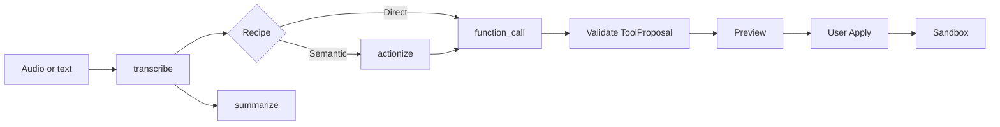
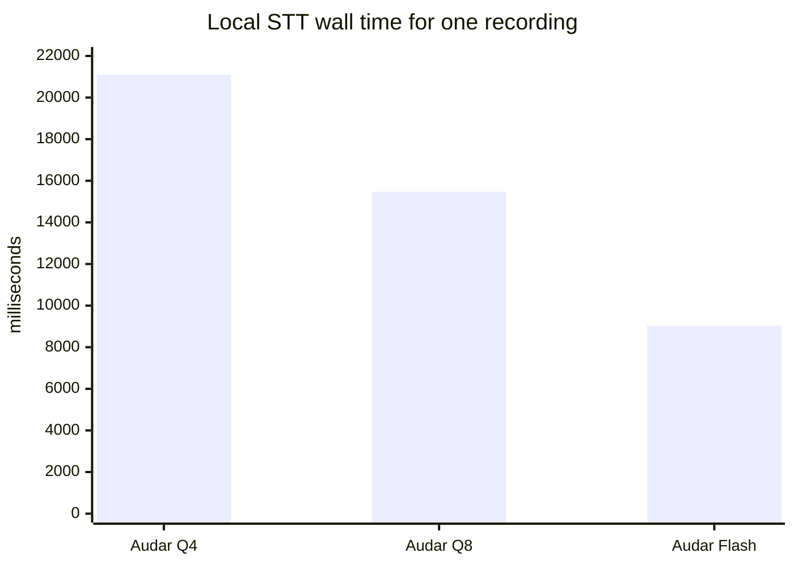

# Saudi STA

Saudi STA is a Windows workbench for turning Arabic or Arabic/English speech
into safe, structured actions. It accepts a recording or text, runs the stages
selected in a recipe, shows the proposed action, and applies it only to a local
sandbox.

For example, this request:

```text
<REDACTED_PRIVATE_TRANSCRIPT>
```

produces:

```json
{
  "status": "READY",
  "tool_name": "add_list_items",
  "arguments": {
    "list_name": "المقاضي",
    "items": ["البيض", "الحليب"]
  }
}
```

The proposal can be previewed and applied to the sandbox. Applying it again
returns `ALREADY_APPLIED`. If the transcript is edited, the old proposal is
rejected as stale.

Maintainer: iO7i

## Run the workbench

Create or activate the Python environment used by the repository, then start
the server on loopback:

```powershell
.\.venv\Scripts\python.exe -m uvicorn app.main:app --host 127.0.0.1 --port 8080
```

Open <http://127.0.0.1:8080> and use the Workbench to record or upload audio,
choose model bindings, run a recipe, inspect the transcript and proposal, and
apply a valid proposal.

Run the tests with:

```powershell
.\.venv\Scripts\python.exe -m pytest -q
```

The current test suite has 64 passing tests. The JavaScript syntax check is:

```powershell
node --check static/app.js
```

## Request flow

Recipes are stage graphs. Each stage has its own binding, so transcription,
summarization, actionization, and function calling can use different models.
Stages not present in a recipe are bypassed.



The supported stage names are `vad`, `turn_detection`, `diarization`,
`transcribe`, `summarize`, `actionize`, `function_call`, `verify`, and
`synthesize`.

The standard recipes are:

```text
Direct              audio → transcribe → function_call
Semantic            audio → transcribe → actionize → function_call
Semantic + summary  audio → transcribe → summarize
                             └────────→ actionize → function_call
```

The summary branch is independent. Function calling receives the original
transcript rather than a summary.

## Available model bindings

Model files are discovered from explicit manifests and are stored outside the
repository. A file appearing on disk does not automatically activate a route.

| Model | Stage | Status |
| --- | --- | --- |
| `AUDAR_TURBO_Q4_LOCAL_BRIDGE` | `transcribe` | Certified local Audar runtime; decoder SHA-256 `c55e3c28225ef6e9b56906a6463af62d34ed417803c45f3b7b20f463af2e8cf4`; BF16 projector SHA-256 `190459e806938175711779847eb62ea609cd78b8d2ec06fb96a94d69ab37a9be` |
| `AUDAR_TURBO_Q8_LOCAL` | `transcribe` | Certified local Audar runtime; decoder SHA-256 `0a91ab40f6a30db06c4186e2f621f504f4625ba6058e639cc09f1cbefded10d2` |
| `AUDAR_FLASH_Q8_LOCAL` | `transcribe` | Certified local Audar runtime; decoder SHA-256 `1b01c707fcf162ef8e844a89f0833bd0d005933342e0c37fa8da164497a9fb38`; projector SHA-256 `73f06fc82a009b4a9d6c825782a3676cb553402b3a5ecc27ae77a92caa6b7fa9` |
| `QWEN38_27B_Q6_K_L` | `function_call` and direct action extraction | Certified for local chat and JSON emulation; `D:\Qwen3.8-27B-UD-Q6_K_L.gguf`, 24,193,919,904 bytes, SHA-256 `121355b4c7422771da25adc74090e3c90138f77ce5c92d348687d47824ec80f4` |
| Whisper Large v3 | `transcribe` | A prior local run exists, but the current Transformers binding is unavailable until Torch/Transformers is installed |

Qwen runs with llama.cpp `b10909-a2878d30d` on CPU, reasoning disabled,
temperature `0`, and a 160-token limit. Its current tool path is
`JSON_EMULATION` followed by strict server-side validation. Native JSON grammar
and native tool calls have not been certified.

## Measurements

The following comparison used the same 8.79-second recording. There is no human
reference for this clip, so the numbers show runtime only, not transcription
quality.



| Candidate | Wall time | Result |
| --- | ---: | --- |
| Audar Turbo Q4 | 21,092 ms | Ready |
| Audar Turbo Q8 | 15,472 ms | Ready |
| Audar Flash Q8 | 9,037 ms | Ready |
| Whisper Large v3 | — | Runtime unavailable |

A three-recording Direct versus Semantic comparison produced 3/3 completed
Direct routes. The Semantic routes failed strict validation because the Qwen
actionization response used `status=OK`, which is not a valid status in the
schema. The failure is retained rather than rewritten into a passing result.

These measurements are development results, not a population-level Saudi
benchmark. Human-reviewed recordings are required before making a quality
ranking.

## Sandbox tools and safety

The sandbox exposes only these operations:

- `create_note_draft`
- `create_reminder_draft`
- `revise_draft`
- `cancel_draft`
- `add_list_items`
- `request_clarification`

The server rejects unknown tools, missing or extra arguments, invalid dates and
times, stale transcript revisions, duplicate Apply requests, and proposals
with invented fields. No tool sends messages, changes a calendar, accesses a
filesystem path supplied by the browser, or calls an external service.

Long model calls run as local jobs with `queued`, `running`, `completed`,
`failed`, `cancelled`, and `timed_out` states. The route limit is 360 seconds.
Cancellation terminates the llama.cpp child process and leaves the server
usable.

Hosted HUMAIN and OpenAI adapters remain disabled. The server reports
`ZERO_SPEND_LOCAL` and blocks remote inference even when credentials exist.

## Recordings and review

Audio and runtime databases are kept in the local runtime directory and are
ignored by Git. Records retain the original transcript, editable transcript
revision, model outputs, stage timings, permissions, and review state.

The authored fixture at `fixtures/authored_smoke.json` contains 28 development
cases. It is useful for contract tests but is not human reference data.

The `SEED_HUMAN_EVAL` workflow is for a private set of 20–30 recordings. For
each recording:

1. record or upload and replay the audio;
2. compare the installed transcription models;
3. enter the verbatim human transcript;
4. define the expected sandbox action or clarification;
5. mark important spans such as numbers, names, negation, and corrections;
6. save the review.

The current seed set is empty. A model output is never promoted to a human
reference automatically.

## API and project documents

Useful endpoints include:

- `GET /api/health`
- `GET /api/catalog`
- `GET /api/models`
- `POST /api/runs/jobs`
- `GET /api/runs/jobs/{job_id}`
- `POST /api/runs/jobs/{job_id}/cancel`

Tournament runs require a preflight response and an explicit start request.

See [architecture](docs/architecture.md),
[tournament methodology](docs/tournament-methodology.md),
[data policy](docs/data-policy.md),
[provider matrix](docs/provider-matrix.md),
[seed recording protocol](docs/seed-human-eval.md), and the
[local model manifest template](docs/local-model-manifest.example.json).

The measured runs and browser checks are recorded under
[`audit/`](audit/), including the real route, STT comparison, runtime safety,
and route tournament reports.

## Scope

This repository is a local research workbench and reference implementation. It
does not train models, run a hosted service, send external messages, or claim a
statistically meaningful model ranking. Model weights, private recordings, and
runtime databases are intentionally not committed.
